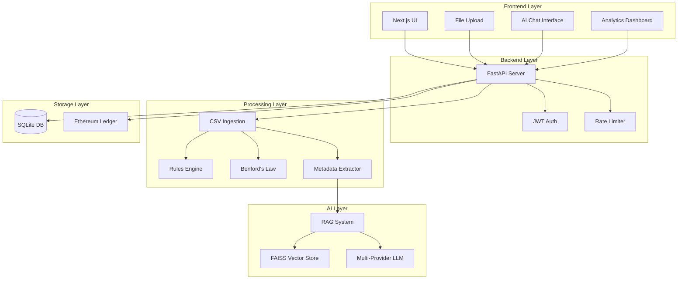

# 🛡️ AuditX: Privacy-First AI Financial Audit System

<div align="center">


**Solving the Privacy–Utility Paradox in AI-Powered Financial Auditing**

[Features](#-features) • [Architecture](#-architecture) • [Quick Start](#-quick-start) • [Documentation](#-documentation) • [Security](#-security)

</div>

---

## 📋 Table of Contents

- [Overview](#-overview)
- [The Privacy Problem](#-the-privacy-problem)
- [Key Features](#-features)
- [Architecture](#-architecture)
- [Technology Stack](#-technology-stack)
- [Installation](#-installation)
- [Configuration](#-configuration)
- [Usage](#-usage)
- [API Documentation](#-api-documentation)
- [Security Features](#-security)
- [Project Structure](#-project-structure)
- [Development](#-development)
- [Testing](#-testing)
- [Deployment](#-deployment)
- [Contributing](#-contributing)
- [License](#-license)

---

## 🎯 Overview

**AuditX** is an enterprise-grade, privacy-first financial audit system that leverages AI to assist auditors **without ever exposing raw financial data to Large Language Models (LLMs)**. 

Traditional AI audit tools face a critical dilemma: they need data to be useful, but exposing sensitive financial information to cloud-based LLMs creates unacceptable privacy and compliance risks. AuditX solves this through a revolutionary **metadata-only architecture**.

### 🔑 Core Innovation

Instead of sending raw transaction data to AI models, AuditX:
1. **Extracts statistical metadata** (counts, distributions, patterns)
2. **Applies deterministic rules** to flag anomalies
3. **Uses Benford's Law** to detect fraud patterns
4. **Sends only metadata** to AI for contextual analysis
5. **Retrieves regulatory citations** via RAG (Retrieval-Augmented Generation)

**Result**: Auditors get AI-powered insights while maintaining complete data privacy.

---

## 🚨 The Privacy Problem

### Traditional AI Audit Tools
```
Raw Financial Data → Cloud LLM → Analysis
❌ PII exposed to third parties
❌ Regulatory compliance violations
❌ Data breach risks
```

### AuditX Approach
```
Raw Data → Metadata Extraction → Secure Analysis → AI Context (RAG) → Insights
✅ Zero PII retention
✅ GDPR/SOX/HIPAA compliant
✅ Tamper-evident audit trails
```

---

## ✨ Features

### 🔒 Privacy & Security
- **Zero Data Retention**: Raw CSV data is processed in-memory and immediately discarded
- **Metadata-Only AI**: LLMs receive only statistical summaries, never raw values
- **JWT Authentication**: Secure token-based user authentication
- **Rate Limiting**: Protection against brute-force and DDoS attacks
- **CORS Whitelisting**: Strict origin control for API access
- **Cryptographic Provenance**: Blockchain-based tamper-evident audit logs (Ethereum)

### 🤖 AI-Powered Analysis
- **Multi-Provider Support**: OpenAI GPT-4, xAI Grok, Google Gemini
- **RAG Integration**: Retrieves relevant regulations from knowledge base
- **Chain-of-Thought Reasoning**: Transparent AI decision-making process
- **Few-Shot Learning**: Improved accuracy through example-based prompting
- **Contextual Explanations**: AI explains findings with regulatory citations

### 📊 Audit Capabilities
- **Benford's Law Analysis**: Detects unnatural digit distributions (fraud indicator)
- **Deterministic Rules Engine**: 
  - Future date detection
  - Negative amount flagging
  - Duplicate transaction identification
  - Threshold violations
- **Risk Scoring**: Automated severity assessment (Low/Medium/High/Critical)
- **PDF Report Generation**: Professional audit reports with charts and findings

### 🌐 Modern Web Interface
- **Next.js 16** frontend with TypeScript
- **Responsive Design**: Mobile-first UI with Tailwind CSS
- **Real-time Chat**: Interactive AI assistant for audit queries
- **File Upload**: Drag-and-drop CSV processing
- **Dashboard**: Visual analytics with Recharts
- **Dark Mode**: Built-in theme support

---

## 🏗️ Architecture



### Data Flow

1. **Upload**: User uploads CSV file via frontend
2. **Ingestion**: Backend parses CSV, extracts metadata
3. **Analysis**: 
   - Deterministic rules flag anomalies
   - Benford's Law detects fraud patterns
   - Metadata is stored; raw data is discarded
4. **AI Processing**:
   - RAG retrieves relevant regulations
   - LLM analyzes metadata with regulatory context
   - Chain-of-thought reasoning generates explanations
5. **Response**: Frontend displays findings, risk scores, and AI insights
6. **Provenance**: Audit hash is recorded on Ethereum blockchain

---

## 🛠️ Technology Stack

### Backend
| Technology | Purpose |
|------------|---------|
| **FastAPI** | High-performance async API framework |
| **Python 3.8+** | Core language |
| **Pandas** | Data processing and analysis |
| **NumPy** | Numerical computations |
| **FAISS** | Vector similarity search for RAG |
| **Sentence Transformers** | Text embeddings |
| **OpenAI/Grok/Gemini** | LLM providers |
| **Web3.py** | Ethereum blockchain integration |
| **ReportLab** | PDF report generation |
| **Python-JOSE** | JWT token handling |
| **Passlib** | Password hashing (bcrypt) |
| **SlowAPI** | Rate limiting middleware |

### Frontend
| Technology | Purpose |
|------------|---------|
| **Next.js 16** | React framework with SSR |
| **TypeScript** | Type-safe development |
| **Tailwind CSS** | Utility-first styling |
| **Radix UI** | Accessible component primitives |
| **Framer Motion** | Smooth animations |
| **Recharts** | Data visualization |
| **React Hook Form** | Form validation |
| **Zod** | Schema validation |
| **Lucide Icons** | Modern icon library |

### Infrastructure
- **SQLite** (development) / **PostgreSQL** (production)
- **Ethereum** (Ganache for local, mainnet/testnet for production)
- **Uvicorn** ASGI server

---

## 🚀 Installation

### Prerequisites
- **Python 3.8+**
- **Node.js 18+** and npm/pnpm
- **Git**
- **(Optional)** Ganache for local blockchain testing

### 1. Clone the Repository
```bash
git clone https://github.com/yourusername/auditx.git
cd auditx
```

### 2. Backend Setup

#### Install Python Dependencies
```bash
cd auditx-backend
pip install -r requirements.txt
```

#### Configure Environment Variables
```bash
cp .env.example .env
```

Edit `.env` with your configuration:
```env
# AI Provider (choose one)
LLM_PROVIDER=grok  # Options: openai, grok, gemini
GROK_API_KEY=your_grok_api_key_here

# Security
JWT_SECRET_KEY=your_secret_key_here  # Generate with: openssl rand -hex 32
REQUIRE_AUTH=false  # Set to true for production

# CORS
ALLOWED_ORIGINS=http://localhost:3000,http://localhost:8000

# Blockchain (optional)
ETH_RPC_URL=http://127.0.0.1:7545
ETH_CONTRACT_ADDRESS=your_contract_address
```

#### Generate JWT Secret
```bash
openssl rand -hex 32
```

### 3. Frontend Setup

```bash
cd ../financial-ai-platform
npm install
# or
pnpm install
```

### 4. (Optional) Blockchain Setup

#### Install Ganache
```bash
npm install -g ganache
```

#### Start Local Blockchain
```bash
ganache --port 7545
```

#### Deploy Smart Contract
```bash
cd ../blockchain
# Follow deployment instructions in blockchain/README.md
```

---

## ⚙️ Configuration

### Environment Variables

| Variable | Description | Default |
|----------|-------------|---------|
| `LLM_PROVIDER` | AI provider (openai/grok/gemini) | `grok` |
| `OPENAI_API_KEY` | OpenAI API key | - |
| `GROK_API_KEY` | xAI Grok API key | - |
| `GEMINI_API_KEY` | Google Gemini API key | - |
| `USE_FEW_SHOT` | Enable few-shot learning | `true` |
| `JWT_SECRET_KEY` | Secret for JWT signing | **REQUIRED** |
| `REQUIRE_AUTH` | Enforce authentication | `false` |
| `ALLOWED_ORIGINS` | CORS allowed origins | `http://localhost:3000` |
| `ETH_RPC_URL` | Ethereum RPC endpoint | `http://127.0.0.1:7545` |
| `ETH_PRIVATE_KEY` | Ethereum private key | - |
| `ETH_CONTRACT_ADDRESS` | Deployed contract address | - |
| `DATABASE_URL` | Database connection string | `sqlite:///./auditx.db` |
| `RATE_LIMIT_ENABLED` | Enable rate limiting | `true` |
| `RATE_LIMIT_PER_MINUTE` | Requests per minute | `100` |
| `LOG_LEVEL` | Logging level | `INFO` |

---

## 📖 Usage

### Start the Application

#### Option 1: Using the Run Script (Recommended)
```bash
# From project root
./run.sh
```

This starts the backend on `http://localhost:8001`

#### Option 2: Manual Start

**Backend**:
```bash
cd auditx-backend
uvicorn app.main:app --reload --host 0.0.0.0 --port 8001
```

**Frontend**:
```bash
cd financial-ai-platform
npm run dev
```

Frontend runs on `http://localhost:3000`

### Access the Application

- **Frontend UI**: http://localhost:3000
- **API Documentation**: http://localhost:8001/docs (Swagger UI)
- **Alternative API Docs**: http://localhost:8001/redoc (ReDoc)

### Default Credentials

**Username**: `admin`  
**Password**: `secret`

> ⚠️ **IMPORTANT**: Change these credentials in production!

---

## 📡 API Documentation

### Authentication Endpoints

#### POST `/api/token`
Login and receive JWT token
```bash
curl -X POST "http://localhost:8001/api/token" \
  -H "Content-Type: application/x-www-form-urlencoded" \
  -d "username=admin&password=secret"
```

**Response**:
```json
{
  "access_token": "eyJhbGciOiJIUzI1NiIsInR5cCI6IkpXVCJ9...",
  "token_type": "bearer"
}
```

#### POST `/api/register`
Register new user
```bash
curl -X POST "http://localhost:8001/api/register" \
  -H "Content-Type: application/json" \
  -d '{"username": "newuser", "email": "user@example.com", "password": "securepass"}'
```

### Analysis Endpoints

#### POST `/api/analyze`
Upload and analyze CSV file
```bash
curl -X POST "http://localhost:8001/api/analyze" \
  -H "Authorization: Bearer YOUR_TOKEN" \
  -F "file=@transactions.csv"
```

**Response**:
```json
{
  "analysis_id": "abc123",
  "metadata": {
    "total_rows": 1000,
    "total_amount": 1500000.50,
    "date_range": ["2024-01-01", "2024-12-31"]
  },
  "anomalies": [
    {
      "type": "future_date",
      "count": 5,
      "severity": "high"
    }
  ],
  "benford_analysis": {
    "chi_square": 12.5,
    "p_value": 0.08,
    "conforms": true
  },
  "ai_insights": "Analysis shows normal distribution patterns..."
}
```

### Chat Endpoints

#### POST `/api/chat`
Ask AI questions about audit findings
```bash
curl -X POST "http://localhost:8001/api/chat" \
  -H "Authorization: Bearer YOUR_TOKEN" \
  -H "Content-Type: application/json" \
  -d '{"message": "What regulations apply to negative amounts?", "analysis_id": "abc123"}'
```

### Report Endpoints

#### GET `/api/report/{analysis_id}`
Generate PDF audit report
```bash
curl -X GET "http://localhost:8001/api/report/abc123" \
  -H "Authorization: Bearer YOUR_TOKEN" \
  --output audit_report.pdf
```

### Regulation Endpoints

#### POST `/api/upload-regulation`
Upload regulatory documents to RAG knowledge base
```bash
curl -X POST "http://localhost:8001/api/upload-regulation" \
  -H "Authorization: Bearer YOUR_TOKEN" \
  -F "file=@sox_compliance.pdf"
```

---

## 🔐 Security

### Security Features

#### 1. **Authentication & Authorization**
- JWT-based authentication with configurable expiration
- Bcrypt password hashing (12 rounds)
- OAuth2-compatible token flow
- Role-based access control (planned)

#### 2. **Rate Limiting**
- 5 requests/minute on authentication endpoints
- 100 requests/minute on analysis endpoints
- Configurable per-endpoint limits
- IP-based tracking

#### 3. **Data Privacy**
- **Zero retention**: Raw CSV data never persisted
- **In-memory processing**: Data cleared after analysis
- **Metadata-only storage**: Only statistical summaries saved
- **No PII logging**: Sensitive data excluded from logs

#### 4. **Network Security**
- CORS whitelisting (no wildcard origins)
- HTTPS enforcement (production)
- Secure headers (CSP, HSTS, X-Frame-Options)
- Request size limits

#### 5. **Blockchain Provenance**
- Immutable audit trail on Ethereum
- SHA-256 hashing of analysis results
- Timestamp verification
- Tamper detection

### Security Best Practices

#### Production Deployment Checklist
- [ ] Change default credentials
- [ ] Generate strong JWT secret (`openssl rand -hex 32`)
- [ ] Enable `REQUIRE_AUTH=true`
- [ ] Use HTTPS with valid SSL certificate
- [ ] Restrict `ALLOWED_ORIGINS` to production domains
- [ ] Use PostgreSQL instead of SQLite
- [ ] Enable database encryption at rest
- [ ] Set up monitoring and alerting
- [ ] Configure firewall rules
- [ ] Regular dependency updates (`pip-audit`, `npm audit`)

---

## 📁 Project Structure

```
auditx/
├── auditx-backend/              # FastAPI backend
│   ├── app/
│   │   ├── main.py              # Application entry point
│   │   ├── api/                 # API endpoints
│   │   │   ├── analyze.py       # CSV analysis endpoint
│   │   │   ├── auth.py          # Authentication logic
│   │   │   ├── chat.py          # AI chat endpoint
│   │   │   ├── report.py        # PDF report generation
│   │   │   ├── upload_regulation.py  # RAG document upload
│   │   │   └── rate_limit.py    # Rate limiting config
│   │   ├── core/                # Core business logic
│   │   │   ├── benford.py       # Benford's Law analysis
│   │   │   ├── rules_engine.py  # Deterministic rules
│   │   │   ├── metadata.py      # Metadata extraction
│   │   │   └── blockchain.py    # Ethereum integration
│   │   ├── ai/                  # AI components
│   │   │   ├── llm_client.py    # Multi-provider LLM client
│   │   │   └── prompts.py       # AI prompts
│   │   ├── rag/                 # RAG system
│   │   │   ├── embeddings.py    # Vector embeddings
│   │   │   ├── retriever.py     # Document retrieval
│   │   │   └── knowledge_base/  # Regulation documents
│   │   └── models/              # Pydantic models
│   ├── requirements.txt         # Python dependencies
│   ├── .env.example             # Environment template
│   └── auditx.db                # SQLite database
│
├── financial-ai-platform/       # Next.js frontend
│   ├── app/                     # Next.js app directory
│   ├── components/              # React components
│   │   ├── ui/                  # Radix UI components
│   │   ├── dashboard/           # Dashboard widgets
│   │   ├── chat/                # Chat interface
│   │   └── upload/              # File upload
│   ├── lib/                     # Utilities
│   ├── styles/                  # Global styles
│   ├── public/                  # Static assets
│   ├── package.json             # Node dependencies
│   └── tailwind.config.ts       # Tailwind configuration
│
├── blockchain/                  # Smart contracts
│   ├── contracts/
│   │   └── AuditLog.sol         # Ethereum audit log contract
│   └── scripts/
│       └── deploy.py            # Deployment script
│
├── run.sh                       # Quick start script
├── cleanup.sh                   # Project cleanup script
└── README.md                    # This file
```

---

## 🧪 Testing

### Backend Tests
```bash
cd auditx-backend
pytest tests/ -v
```

### Frontend Tests
```bash
cd financial-ai-platform
npm test
```

### API Testing
Use the interactive Swagger UI at `http://localhost:8001/docs`

### Manual Testing Workflow
1. Start backend: `./run.sh`
2. Start frontend: `cd financial-ai-platform && npm run dev`
3. Login with default credentials
4. Upload sample CSV: `sample_data.csv`
5. Review analysis results
6. Ask AI questions via chat
7. Generate PDF report

---

## 🚢 Deployment

### Docker Deployment (Recommended)

#### Build Images
```bash
# Backend
docker build -t auditx-backend ./auditx-backend

# Frontend
docker build -t auditx-frontend ./financial-ai-platform
```

#### Run with Docker Compose
```bash
docker-compose up -d
```

### Manual Deployment

#### Backend (Ubuntu/Debian)
```bash
# Install dependencies
sudo apt update
sudo apt install python3-pip nginx

# Setup application
cd auditx-backend
pip install -r requirements.txt

# Configure systemd service
sudo nano /etc/systemd/system/auditx.service
```

**Service file**:
```ini
[Unit]
Description=AuditX Backend
After=network.target

[Service]
User=www-data
WorkingDirectory=/var/www/auditx/auditx-backend
Environment="PATH=/usr/local/bin"
ExecStart=/usr/local/bin/uvicorn app.main:app --host 0.0.0.0 --port 8001

[Install]
WantedBy=multi-user.target
```

```bash
sudo systemctl enable auditx
sudo systemctl start auditx
```

#### Frontend (Vercel/Netlify)
```bash
cd financial-ai-platform
npm run build
# Deploy to Vercel: vercel --prod
```

### Environment-Specific Configurations

#### Production
- Use PostgreSQL database
- Enable HTTPS
- Set `REQUIRE_AUTH=true`
- Use production LLM API keys
- Configure CDN for static assets

#### Staging
- Use separate database
- Enable debug logging
- Test with production-like data

---

## 🤝 Contributing

We welcome contributions! Please follow these guidelines:

### Development Workflow
1. Fork the repository
2. Create a feature branch: `git checkout -b feature/amazing-feature`
3. Make your changes
4. Run tests: `pytest` and `npm test`
5. Commit: `git commit -m 'Add amazing feature'`
6. Push: `git push origin feature/amazing-feature`
7. Open a Pull Request

### Code Standards
- **Python**: Follow PEP 8, use type hints
- **TypeScript**: Follow ESLint rules
- **Commits**: Use conventional commits (feat, fix, docs, etc.)
- **Documentation**: Update README for new features

---

## 📄 License

This project is licensed under the MIT License - see the [LICENSE](LICENSE) file for details.

---

## 🙏 Acknowledgments

- **FastAPI** for the excellent async framework
- **Next.js** team for the powerful React framework
- **OpenAI, xAI, Google** for LLM APIs
- **Ethereum Foundation** for blockchain infrastructure
- **Open-source community** for amazing tools and libraries

---

## 📞 Support

- **Documentation**: [Full docs](https://docs.auditx.example.com)
- **Issues**: [GitHub Issues](https://github.com/yourusername/auditx/issues)
- **Email**: support@auditx.example.com
- **Discord**: [Join our community](https://discord.gg/auditx)

---

## 🗺️ Roadmap

### Version 2.1 (Q2 2026)
- [ ] PostgreSQL migration
- [ ] Multi-tenancy support
- [ ] Advanced role-based access control
- [ ] Real-time collaboration features

### Version 3.0 (Q3 2026)
- [ ] Machine learning fraud detection
- [ ] Multi-language support
- [ ] Mobile app (React Native)
- [ ] Advanced data visualization

---

## 👥 Team ProDevs

| Name | Role |
|------|------|
| **Mithran A** | Backend Lead |
| **Hari Ragav KS** | Frontend Developer |
| **Mohamed Shameel** | Frontend Developer |

---

<div align="center">

**Built with ❤️ by Team ProDevs**

[⬆ Back to Top](#️-auditx-privacy-first-ai-financial-audit-system)

</div>
